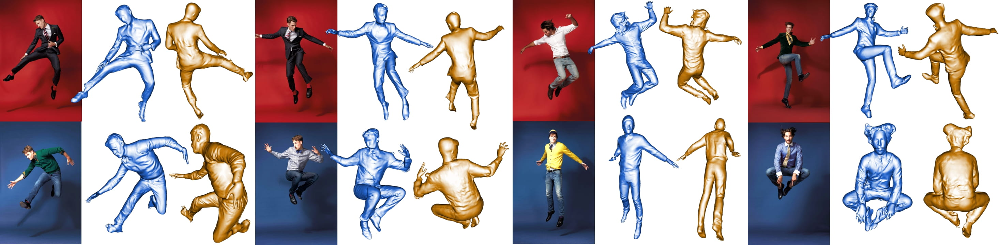
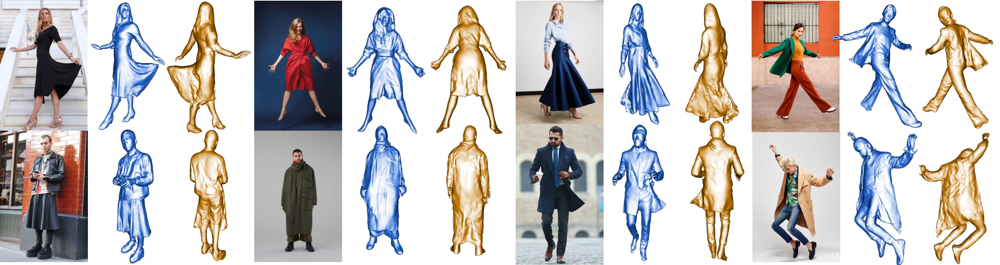
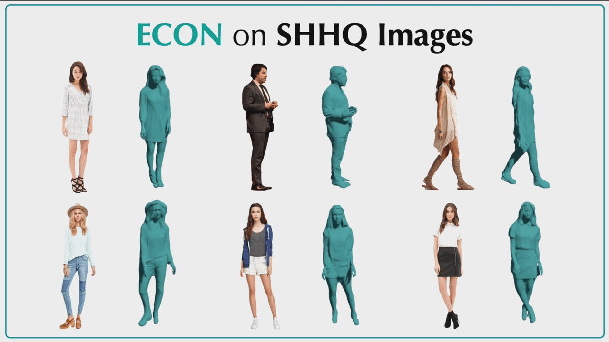

<!-- PROJECT LOGO -->

<p align="center">

  </p>
  <h2 align="center">MetaSmart</h2>
  <div align="center">
    
  </div>

  <p align="center">
  <br>
    <a href="https://pytorch.org/get-started/locally/"></a>
    <a href="https://pytorchlightning.ai/"></a>
    <a href="https://cupy.dev/"></a>
    <br></br>

<br/>

HDFI is designed for "Human digitization from a color image", which combines the best properties of implicit and explicit representations, to infer high-fidelity 3D clothed humans from in-the-wild images, even with **loose clothing** or in **challenging poses**. HDFI also supports **multi-person reconstruction** and **SMPL-X based animation**.
<br/>
<br/>

<br>

<!-- TABLE OF CONTENTS -->
<details open="open" style='padding: 10px; border-radius:5px 30px 30px 5px; border-style: solid; border-width: 1px;'>
  <summary>Table of Contents</summary>
  <ol>
    <li>
      <a href="#instructions">Instructions</a>
    </li>
    <li>
      <a href="#demo">Demo</a>
    </li>
    <li>
      <a href="#applications">Applications</a>
    </li>
    <li>
      <a href="#tricks">Tricks</a>
    </li>
    <li>
      <a href="#citation">Citation</a>
    </li>
  </ol>
</details>

<br/>

## Instructions

- See [docs/installation.md](docs/installation.md) to install all the required packages and setup the models

## Demo

```bash
# For single-person image-based reconstruction
python -m apps.infer -cfg ./configs/HDFI.yaml -in_dir ./examples -out_dir ./results

# For multi-person image-based reconstruction (see config/HDFI.yaml)
python -m apps.infer -cfg ./configs/HDFI.yaml -in_dir ./examples -out_dir ./results -multi

# To generate the demo video of reconstruction results
python -m apps.multi_render -n {filename}

# To animate the reconstruction with SMPL-X pose parameters
python -m apps.avatarizer -n {filename}
```

## Tricks

### Some adjustable parameters in _config/HDFI.yaml_

- `use_ifnet: False`
  - True: use IF-Nets+ for mesh completion ( $\text{HDFI}_\text{IF}$ - Better quality, **~2min / img**)
  - False: use SMPL-X for mesh completion ( $\text{HDFI}_\text{EX}$ - Faster speed, **~1.5min / img**)
- `use_smpl: ["hand", "face"]`
  - [ ]: don't use either hands or face parts from SMPL-X
  - ["hand"]: only use the **visible** hands from SMPL-X
  - ["hand", "face"]: use both **visible** hands and face from SMPL-X
- `thickness: 2cm`
  - could be increased accordingly in case final reconstruction **xx_full.obj** looks flat
- `k: 4`
  - could be reduced accordingly in case the surface of **xx_full.obj** has discontinous artifacts
- `hps_type: PIXIE`
  - "pixie": more accurate for face and hands
  - "pymafx": more robust for challenging poses
- `texture_src: image`
  - "image": direct mapping the aligned pixels to final mesh
  - "SD": use Stable Diffusion to generate full texture (TODO)

<br/>

## More Qualitative Results

|      |
| :------------------------------------: |
|          _Challenging Poses_           |
|  |
|            _Loose Clothes_             |

## Applications

|                                                                                |                   |
| :----------------------------------------------------------------------------------------------------: | :-----------------------------------------: |
| _HDFI could provide pseudo 3D GT for [SHHQ Dataset](https://github.com/stylegan-human/StyleGAN-Human)_ | _HDFI supports multi-person reconstruction_ |

<br/>
<br/>

## Citation

```bibtex
@article{xiu2022econ,
    title={{HDFI: Human Digitization From Image}},
    author={Xiu, Yuliang and Yang, Jinlong and Cao, Xu and Tzionas, Dimitrios and Black, Michael J.},
    year={2022}
    journal={{arXiv}:2212.07422},
}
```

<br/>

## Acknowledgments

We thank [Lea Hering](https://is.mpg.de/person/lhering) and [Radek Daněček](https://is.mpg.de/person/rdanecek) for proof reading, [Yao Feng](https://ps.is.mpg.de/person/yfeng), [Haven Feng](https://is.mpg.de/person/hfeng), and [Weiyang Liu](https://wyliu.com/) for their feedback and discussions, [Tsvetelina Alexiadis](https://ps.is.mpg.de/person/talexiadis) for her help with the AMT perceptual study.

Here are some great resources we benefit from:

- [ICON](https://github.com/YuliangXiu/ICON) for SMPL-X Body Fitting
- [BiNI](https://github.com/hoshino042/bilateral_normal_integration) for Bilateral Normal Integration
- [MonoPortDataset](https://github.com/Project-Splinter/MonoPortDataset) for Data Processing, [MonoPort](https://github.com/Project-Splinter/MonoPort) for fast implicit surface query
- [rembg](https://github.com/danielgatis/rembg) for Human Segmentation
- [MediaPipe](https://google.github.io/mediapipe/getting_started/python.html) for full-body landmark estimation
- [PyTorch-NICP](https://github.com/wuhaozhe/pytorch-nicp) for non-rigid registration
- [smplx](https://github.com/vchoutas/smplx), [PyMAF-X](https://www.liuyebin.com/pymaf-x/), [PIXIE](https://github.com/YadiraF/PIXIE) for Human Pose & Shape Estimation
- [CAPE](https://github.com/qianlim/CAPE) and [THuman](https://github.com/ZhengZerong/DeepHuman/tree/master/THUmanDataset) for Dataset
- [PyTorch3D](https://github.com/facebookresearch/pytorch3d) for Differential Rendering

Some images used in the qualitative examples come from [pinterest.com](https://www.pinterest.com/).

This project has received funding from the European Union’s Horizon 2020 research and innovation programme under the Marie Skłodowska-Curie grant agreement No.860768 ([CLIPE Project](https://www.clipe-itn.eu)).

---

<br>

## License

This code and model are available for non-commercial scientific research purposes as defined in the [LICENSE](LICENSE) file. By downloading and using the code and model you agree to the terms in the [LICENSE](LICENSE).

## Disclosure

MJB has received research gift funds from Adobe, Intel, Nvidia, Meta/Facebook, and Amazon. MJB has financial interests in Amazon, Datagen Technologies, and Meshcapade GmbH. While MJB is a part-time employee of Meshcapade, his research was performed solely at, and funded solely by, the Max Planck Society.

## Contact

For technical questions, please contact yuliang.xiu@tue.mpg.de

For commercial licensing, please contact ps-licensing@tue.mpg.de
